# 4 Zadaca - Operacijski sustavi
Vilibald Kovac  
informatika (online)  
0303126466

---

## Instalacija

 1. **Preuzmite i instalirajte** VirtualBox na svoje računalo. ✅
 2. **Preuzmite i instalirajte** Ubuntu Server (LTS verziju) te **izradite novi virtualni stroj**.  
   Tijekom instalacije Ubuntu Servera, za `username` unesite svoje ime i prezime u formatu: `ime.prezime`. ✅

3. Nakon instalacije, **napravite _screenshot_ početnog zaslona** Ubuntu Servera na kojem se jasno vidi vaše korisničko ime i naziv virtualnog stroja.

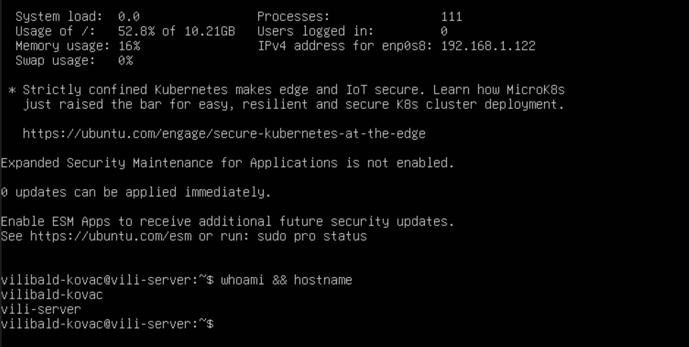

## 2. **Za svaki od sljedećih zadataka napravite odgovarajući _screenshot_:**

- Ažurirajte lokalnu listu dostupnih paketa i verzija te nadogradite sve pakete na najnovije verzije.

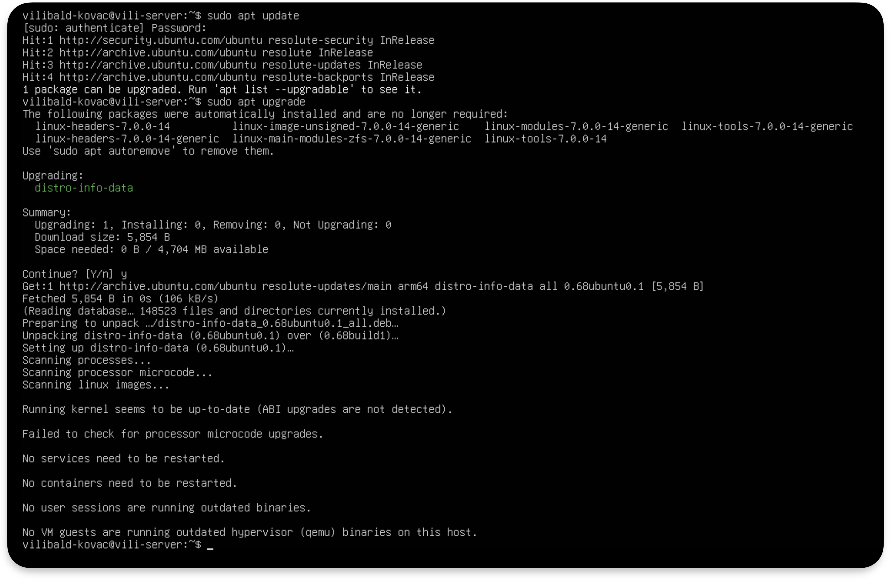

- Instalirajte paket `openssh-server`, pokrenite SSH poslužitelj i provjerite njegov status.

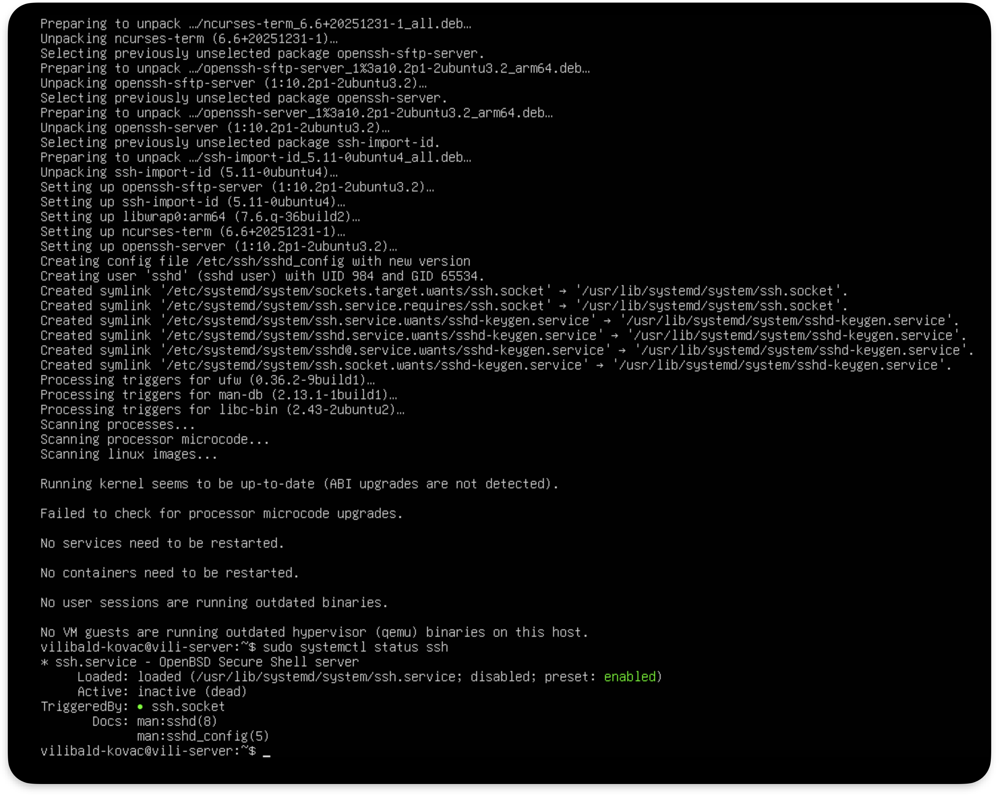 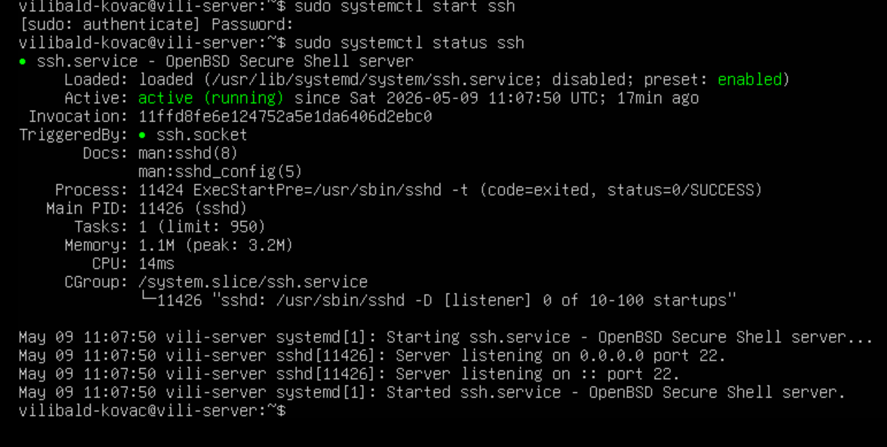

- Pronađite IP adresu virtualnog stroja i provjerite koji su mrežni portovi otvoreni.  

Ip adresu mozemo naci sa naredbom `ip a` ili `hostname -I`
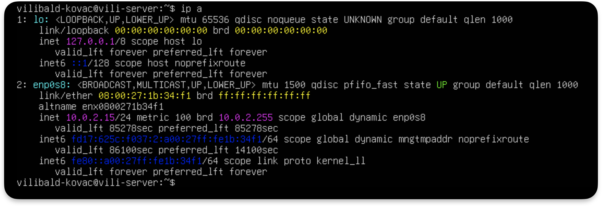

- _Kako ćete provjeriti koji port koristi SSH poslužitelj?_ 
Mozemo vidjeti port u statusu SSH posluzitelja ili pomocu `ss -tuln`

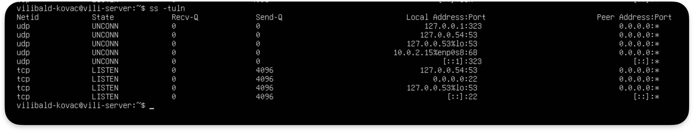

- Povežite se na SSH poslužitelj putem SSH klijenta na dva načina:
  - korištenjem **NAT adaptera i _port forwardinga_**

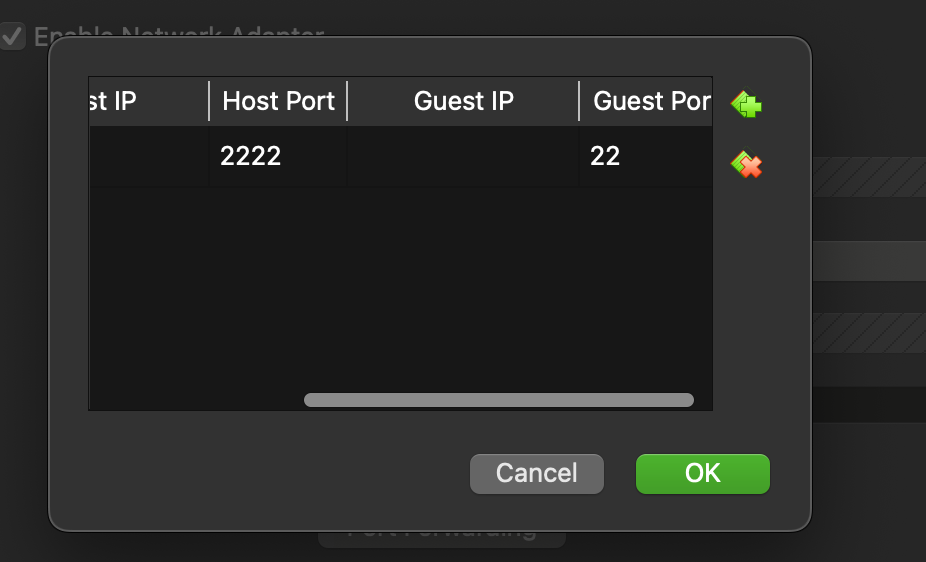
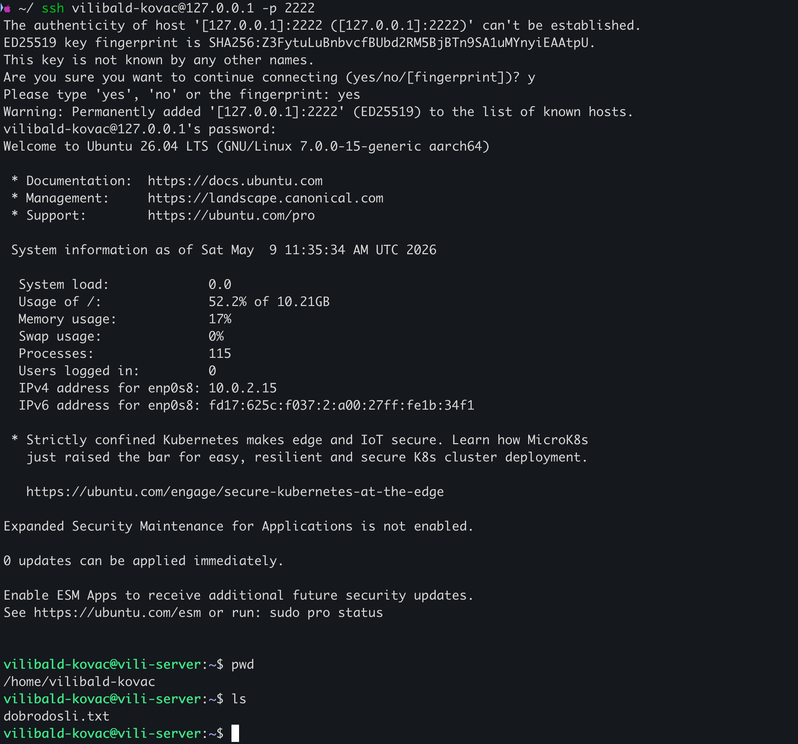

  - korištenjem **Bridged adaptera**

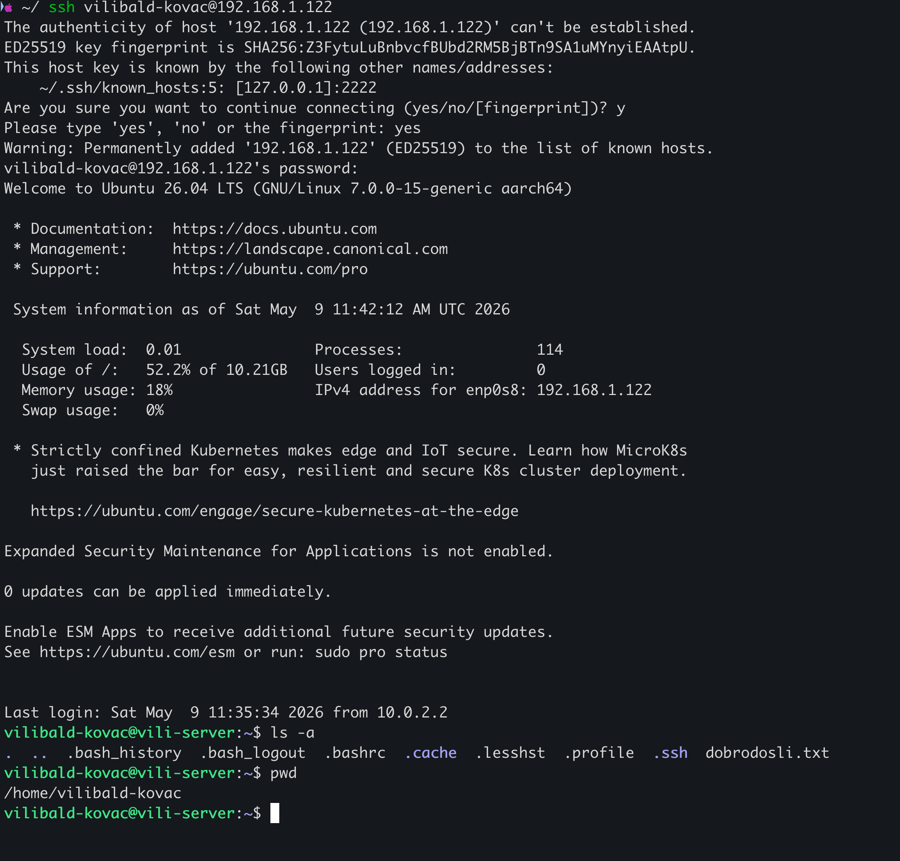

## 3. Skripta 

Putem domaćina, **izradite novu bash skriptu** unutar virtualnog stroja, u direktoriju `/home/username/`. Skripta treba napraviti **detaljan ispis svih datoteka** (uključujući skrivene) iz korijenskog direktorija VM-a (`/`).

Screenchot terminala domacina:  
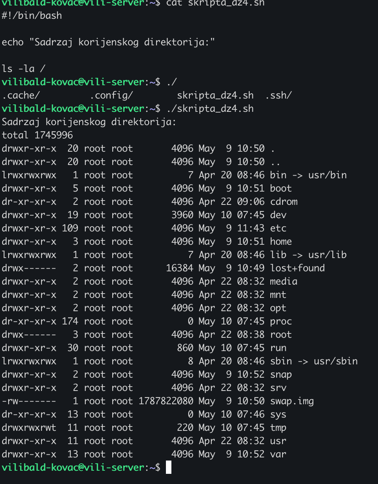
  
Screnshot iz VM-a:  
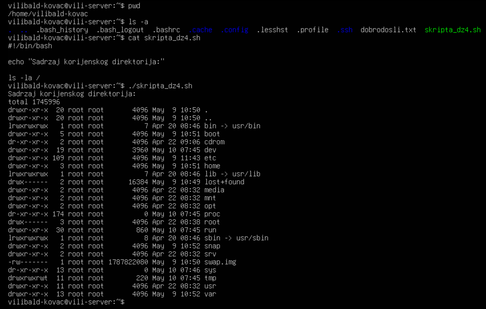