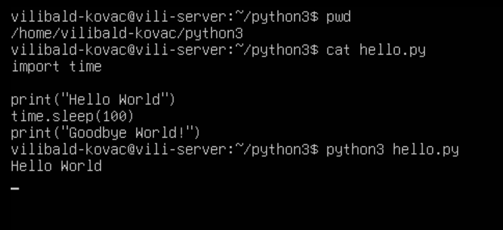
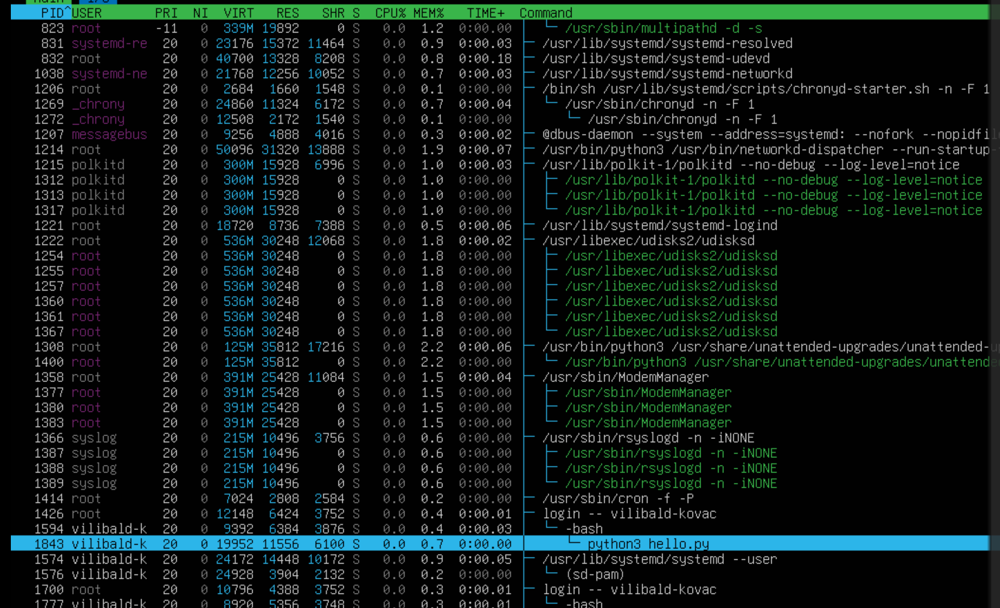
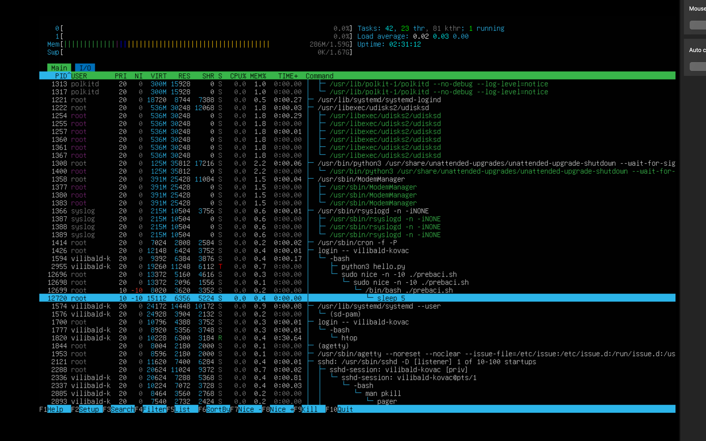
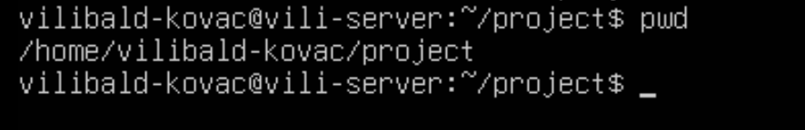
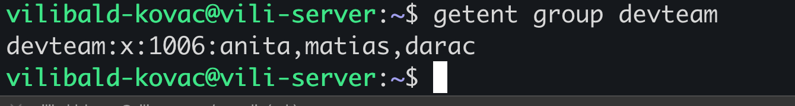
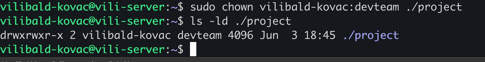
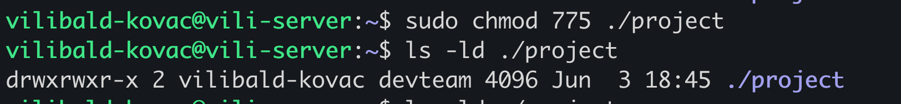
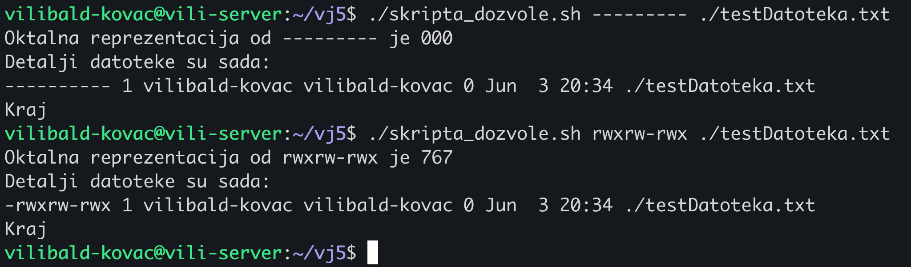

# Zadatci za Bod (Zadaci za Vježbu 5)

## **Zadatak 1**

### Instalirajte `python3` paket na vašem VM-u. Unutar _home_ direktorija stvorite direktorij `python3` i datoteku `hello.py` koja ispisuje "Hello World!", a nakon 100 sekundi ispisuje "Goodbye World!".



### Pokrenite skriptu i prebacite se u drugi terminal ili pokrenite u pozadini. Unutar `htop` alata ispišite i objasnite sve detalje o procesu koji je pokrenut.




* **PID 1843** - jedinstveni broj procesa
* **USER vilibald-k** - korisnik koji je pokrenuo proces
* **PRIORITET**
* stupac `PRI` s vrijednošću 20 opisuje prioritet procesa, a vrijednost 20 je standardni prioritet. U stupcu `NI` vidimo 0 što je nice vrijednost koja se koristi za određivanje prioriteta procesa. Po izračunu `PRI = 20 + NI` se točno vidi da je nam odgovara da nam je prioritet 20, a nice vrijednost 0.

* **MEMORIJA** - količina memorije u stupcu `VIRT`, 19952 KiB (budući da nema oznake tada je u Kibibajtima, a 1 KiB = 1024 Bajtova) je u virtualnoj memoriji. 11556 KiB u stupcu `RES` je u fizičkoj memoriji, a 6100 KiB u stupcu `SHR` je dijeljena memorija, dakle memorija koju koristi proces ali je dijeli s drugim procesima. Udio koristenja RAM memorije prikazan je u `MEM%` i zauzima 0.7% ukupne memorije.
* **AKTIVNOST** - proces je u stanju mirovanja što je označeno kao `S` (sleeping) u stupcu `S`, što znači da ne koristi CPU resurse što i možemo vidjeti u stupcu `CPU%` gdje je 0.0%.
* **VRIJEME** - stupac `TIME+` prikazuje vrijeme koje je proces proveo koristeći CPU resurse, trenutno 0 sekundi. Pretpostavljam da je rad trajao toliko kratko prije ulaska u sleep state da ga sustav nije uspio izmjeriti na decimalu koja se tu prikazuje.
* **NAZIV COMMAND python3 hello.py**
* naredba koja je pokrenula proces.


### Napišite barem 3 načina kako biste prekinuli taj proces naredbom kill.

- naredbok kill s PID-om procesa, npr. `kill 1843`
  - koristimo PID procesa i prekidamo na "nice" nacin 
- naredbom `kill -9 1843`
  - provjerimo PID procesa i koristimo `-9` za agresivno prekidanje 
- naredbom `pkill -f hello.py`
  - zelimo prekinuti temeljem imena, a ne PID broja, `f` trazi dio imena procesa

---


## **Zadatak 2**

### Napravite direktorije `old_dir` i `new_dir` unutar vašeg _home_ direktorija i napunite ih proizvoljnim datotekama. Napišite bash skriptu koja će prebaciti datoteku po datoteku iz direktorija `old_dir` u `new_dir` i nakon svakog prebacivanja ispisati poruku "Datoteka prebačena" i pričekati 1 sekundu.


Skripta 

```bash

novi="/home/vilibald-kovac/new_dir"
stari="/home/vilibald-kovac/old_dir"

if [[ ! -d  $novi  ]];then
	echo "Ne postoji direktorij na putanji ${novi}"
	exit 1
fi

# pazi zastavica ide ispred
if [[ ! -d $stari  ]];then
	echo "Ne postoji direktorij na putanji ${stari}"
	exit 2
fi

for dat in "$stari"/*; do

if [[ -f $dat ]]; then

# dobro je dodati /
mv "$dat" "${novi}/"

ime_datoteke=$(basename "$dat")
echo "Datoteka ${ime_datoteke} prebacena"
sleep 1

fi

done

```


### Pokrenite skriptu sa zadanim, većim i manjim `NI` prioritetom i napravite screenshot `htop` alata.

- sa zadanim samo pokrecemo i ne moramo pisati 
- za veci prioritet npr. `sudo nice -n -10 ./prebaci.sh`
- za manji prioritet npr. `sudo nice -n 10 ./prebaci.sh`

Screencshot pokretanja s vecim prioritetom (stavio sam `sleep` na 5 da stignem napraviti screenshot):




## **Zadatak 3**

### Potrebno je definirati novu grupu `devteam` za vašu ekipu. Napravite novi direktorij `project` u _home_ direktoriju vašeg korisnika.




### Stvorite nekoliko novih korisnika i dodajte ih u grupu `devteam`.



### Za direktorij `project`, vi ostajete vlasnik, a grupu postavite na `devteam`.





### Definirajte dozvole za direktorij `project` tako da svi članovi grupe `devteam` mogu čitati, pisati i ući u direktorij, vi možete čitati, pisati i izvršavati, a ostali korisnici mogu samo čitati sadržaj i ući u direktorij. Kod direktorija je dozvola `x` potrebna za ulazak/pretraživanje direktorija.




```bash 
vilibald-kovac@vili-server:~$ ls -ld ./project
drwxrwxr-x 2 vilibald-kovac devteam 4096 Jun  3 18:45 ./project
vilibald-kovac@vili-server:~$ sudo chmod 775 ./project
vilibald-kovac@vili-server:~$ ls -ld ./project
```

## **Zadatak 4**

Definirajte oktalne reprezentacije dozvola za sljedeće dozvole:

- `rwxr-xr-x`
  - 755
  - vlasnik moze sve (citati, pisati, izvrsavati), grupa i ostali korisnici oboje mogu citati i izvrsavati 
- `rw-r--r--`
  - 644
  - vlasnik moze citati i pisati, grupa i ostali korisnici samo citati
- `rwx------`
  - 700
  - vlasnik moze sve, grupa i ostali korisnici ne mogu nista
- `rw-rw-r--`
  - 664 
  - vlasnik moze citati i pisati, grupa moze citati i pisati, ostali korisnici mogu samo citati
- `rwxrwxrwx`
  - 777
  - svi imaju sve dozvole
  - `r--r--r--`
  - 444
  - svi mogu samo citati
- `rw-------`
  - 600
  - samo vlasnik moze citati i pisati, ostali nemaju dozvole


## **Zadatak 5**

Napišite bash skriptu koja očekuje dva argumenta:

1. Znakovna reprezentacija (9 znakova) dozvola (npr. `rwxr-xr--`)
2. Apsolutnu putanju do neke datoteke (npr. `/home/lukablaskovic/test.txt`)

Skripta mora izračunati oktalnu reprezentaciju dozvole i primijeniti je na datoteku na danoj putanji.

Ako korisnik ne proslijedi točno 2 argumenta, ispišite poruku upozorenja i prekinite rad skripte.

_Primjer:_

```bash
→ apply.sh rwxr-xr-- /home/lukablaskovic/test.txt
```





Skripta 

```bash

#!/bin/bash

if [[ $# -ne 2 ]]; then
	echo "Potrebno je unijeti tocno dva argumenta: znakovnu reprezentaciju i apsolutnu putanju do datoteke!"
	exit 1
fi

putanja=$2

if [[ ! -e $putanja ]]; then
	echo "$putanja nije postojeca datoteka."
	exit 2
fi

znakovi=$1

if [[ ${#znakovi} -ne 9 ]]; then
	echo "Znakovna reprezentacija mora imati 9 znakova."
	exit 3
fi


vlasnik=0
grupa=0
ostali=0
brojac=0

for ((i=0; i<9; i++)); do

# slicing
znak=${znakovi:${i}:1}

((brojac+=1))

	if [[ $znak == "r" ]];then
			vrijednost=4
	elif [[ $znak == "w" ]];then
		vrijednost=2
	elif [[ $znak  == "x" ]];then
			vrijednost=1
	else
		 vrijednost=0
	fi

	if [[  $brojac -le 3 ]];then
		((vlasnik+=vrijednost))
	elif [[ $brojac -le 6 ]];then
		((grupa+=vrijednost))
	else
		 ((ostali+=vrijednost))
	fi


done

oktalni="${vlasnik}${grupa}${ostali}"

chmod "$oktalni" "$putanja"

echo "Oktalna reprezentacija od $znakovi je $oktalni"
echo "Detalji datoteke su sada: "

ls -ld "$putanja"	

echo "Kraj"

```